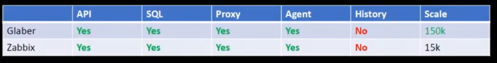

# Dockerized [glaber](https://glaber.io/)

Glaber is zabbix server fork (currently based on zabbix 5.4.11).

Key differences from zabbix:
- Better perfomance (x100 greater then zabbix)

Key similarities from zabbix:
- 100% compatibility with zabbix (except history api)


This repo can be used as starting point to **migrate from your current zabbix installation to glaber**.

The main reasons for this may be:

- The performance of zabbix proxies is constantly not enough, you have to add new ones.
- Restarting the monitoring system takes a long time.
- You are faced with an architecturally unsolvable problem where increasing the performance of the zabbix server, zabbix proxy server, database tuning does not improve the performance of the monitoring system as a whole.


# Hardware requirements:

- CPU:  1 cpu like `cpu xeon e5` perfomance enough.
- RAM:  8G RAM.
- DISK: SSD preferred. Depend from your zabbix setup.

This setup enough for zabbix setup with 20k nvps perfomance.

# Software requirements:

Linux operation system with internet access and software installed:
- docker >=20.10.22 
- docker-compose >=1.29.2
- apache2-utils

## Components 

- glaber server
- glaber nginx
- clickhouse as history storage backend
- mysql as the main database backend

# Migration guide (under develop):

- Feel free to ask a [solution](https://glaber.ru/pricing.html) according to your infrastructure
- As glaber and zabbix have backward compatibility you can try to replace one zabbix component to glaber component one by one (for example change zabbix proxy to glaber proxy)
- You can install glaber in parallel to zabbix and redirect all zabbix agents and zabbix proxy to the glaber server


# Installation:

- Make directory for glaber:

  `mkdir /opt/glaber`
- Copy this repository to glaber directory:
  ```bash
  cd /opt/glaber
  git clone git@github.com:bakaut/glaber.git .
  ```
- Start glaber:

  `./glaber.sh start`

This action create passwords for clickhouse ans mysql and docker-compose up all glaber components. This action needs sudo access.

# After success  build and start:
- Zabbix web Admin password located in `.zbxweb` and displayed to stdout
- All passwords variables are updated in `.env` file

# Default credentials:

- Zabbix web. http://127.0.0.1 - Admin,`<random generated>`
- Mysql server. Db,User,Pass   - zabbix,zabbix,`<random generated>`
- Clickhouse. Db,User,Pass     - zabbix,defaultuser,`<random generated>`


# Default ENV variables:

All variables, their default values and their default behavior are described in `.env` file

# Usage:
```bash
./glaber.sh <action>

./glaber.sh build    - Build docker images
./glaber.sh start    - Build docker images and start glaber
./glaber.sh stop     - Stop glaber containers
./glaber.sh recreate - Completely remove glaber and start it again
./glaber.sh remove   - Completely remove glaber installation
./glaber.sh diag     - Collect glaber start logs and some base system info to the file
```

# Restrictions accepted:

- Community support (feel free to make [issue](https://github.com/bakaut/glaber/issues/new) or write to telegram group https://t.me/glaber_group)
- Supported software version:
  - Only one last version. Currently 2.18.0 for glaber based on zabbix 5.4.11
    - glaber-server-mysql
    - glaber-nginx
    - clickhouse-server, docker image version 21.3.20
    - percona, docker image version 8.0.29-21-centos

- Variables:
  - Only a part of the main parameters has been moved to ``.env``. If you need other, fill free to create [issue](https://github.com/bakaut/glaber/issues/new)

These restrictions apply only to this repository, to the docker version of glaber, not to the glaber product in general.